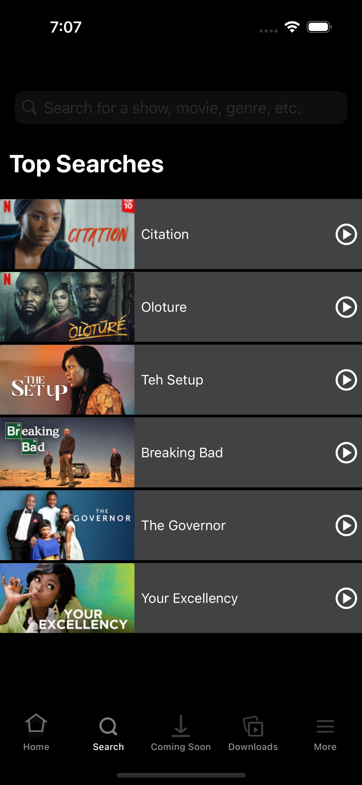
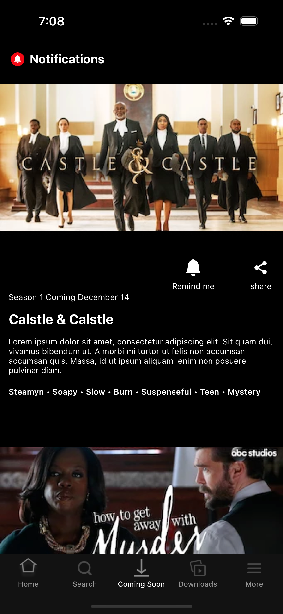
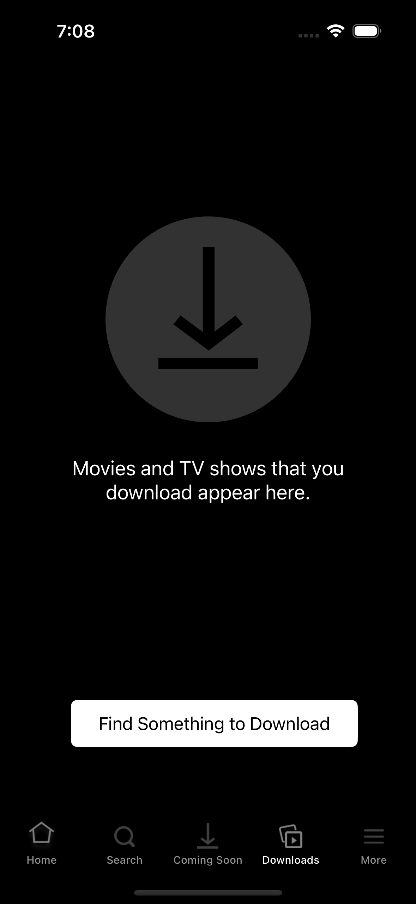

# 과제3

- search bar 시행착오 겪음
- 탭바 만들때 let vc2 = UINavigationController(rootViewController: SearchViewController()) 를 선언해서 View를 controller에 embed 해야함
- 상단 패딩이나 폰트 및 백그라운드 컬러 조정, 마이크 이미지 넣는걸 아무리 해도 적용이 안됨

