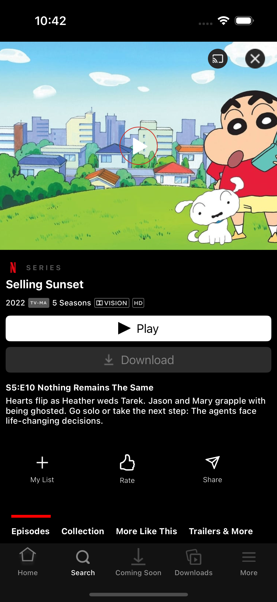
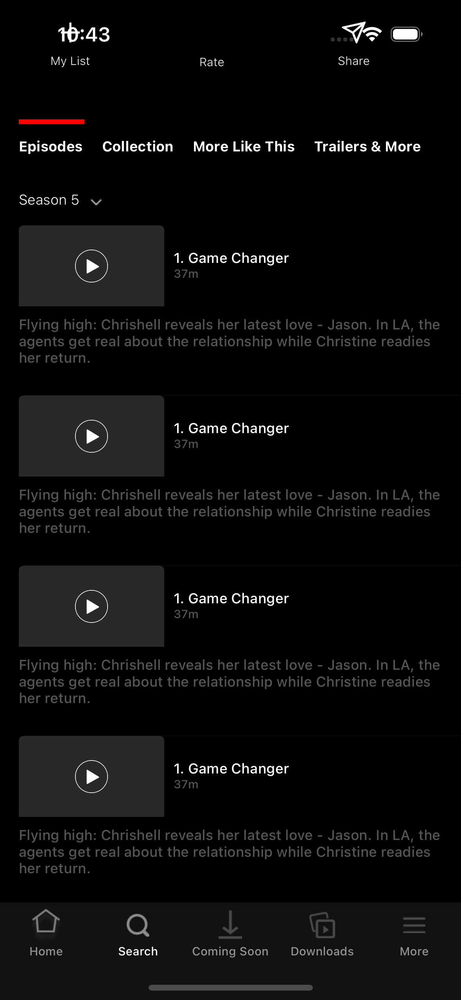

# 과제5

<p align="center">


</p>

1. UINavigationController

   UINavigationController를 사용하여 화면 전환

   ```swift
   // cell을 선택했을때 다른 화면으로 넘어감
    func tableView(_ tableView: UITableView, didSelectRowAt indexPath: IndexPath) {
        let vc = DetailController()
        navigationController?.pushViewController(vc, animated: true)
    }
   ```

   기본적으로 제공하는 뒤로가기 버튼 비활성화

   ```swift
   navigationItem.hidesBackButton = true
   ```

   커스텀한 버튼 적용

   ```swift
   let customBackButton: UIButton = {
        let button = UIButton(type: .custom)
        button.setImage(UIImage(named: "back"), for: .normal)

        button.addTarget(self, action: #selector(didTapBackButton), for: .touchUpInside)
        button.translatesAutoresizingMaskIntoConstraints = false
        return button
    }()

    // 이 함수를 실행해면 pop()
    @objc func didTapBackButton(){
        navigationController?.popViewController(animated: true)
    }

   ```

2. TableView Header

   tableView Header를 따로 파일을 만들어서 생성하였습니다. 이럴 경우 뒤로가기 버튼을
   구현하기 위해서는 프로토콜을 만들어서 권한을 위임해줘야 한다

   ```swift
    import UIKit

    protocol HeaderViewDelegate: AnyObject {
        func didTapBackButton()
    }

    class DetailHeaderUIView:UIView {

        weak var delegate: HeaderViewDelegate?

        let customBackButton: UIButton = {
            let button = UIButton(type: .custom)
            button.setImage(UIImage(named: "back"), for: .normal)

            button.addTarget(self, action: #selector(backButtonTapped), for: .touchUpInside)
            button.translatesAutoresizingMaskIntoConstraints = false
            return button
        }()

        @objc func backButtonTapped() {
            // Notify the delegate when the back button is tapped
            delegate?.didTapBackButton()
        }
    }
   ```

   header height 동적으로 적용하기

   아래 코드를 적용하면 헤더의 높이를 알아서 필요한 만큼 사용한다.

   그런데 뭔가 문제가 있는지 cell 들이랑 겹쳐 나와서 일단은 적용 보류

   이걸 알아내야 디자이너가 원하는 값을 정확히 줄 수 있음

   ```swift
   let headerView = DetailHeaderUIView(frame: CGRect(x: 0, y: 0, width: view.frame.width, height: 0))

    // Ensure the layout is up to date
    headerView.setNeedsLayout()
    headerView.layoutIfNeeded()
    // Calculate the required size for the header
    let headerSize = headerView.systemLayoutSizeFitting(UIView.layoutFittingCompressedSize)

    // Set the calculated height
    headerView.frame = CGRect(x: 0, y: 0, width: view.frame.width, height: headerSize.height)
    tableView.tableHeaderView = headerView
   ```

3. UIStackView

   UIStackView에 trailingAnchor 적용시 스택뷰 내부의 아이템들 거리를 자기 마음대로 늘려서 배치함

   아직 원인을 찾지 못함 어떤 stackView에는 늘어나고 어떤 경우에는 정상적으로 배치 됨
   trailingAnchor를 적용안하면 되긴 하는데 왜 이런 현상이 일어나는지 모르겠음

4. UIImageView 비율
   사진 비율 유지하려고 하면 빈공간이 생김 이것도 해결 방법 아직 못 찾음
